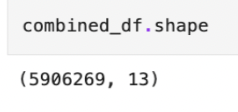
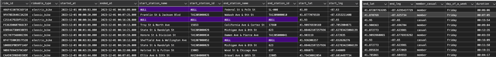
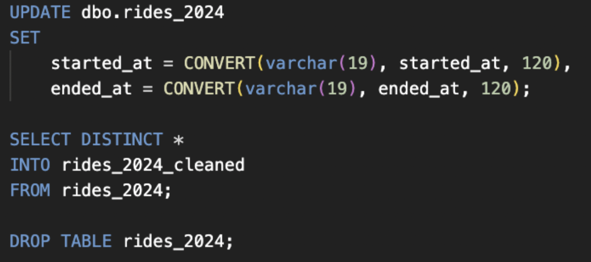
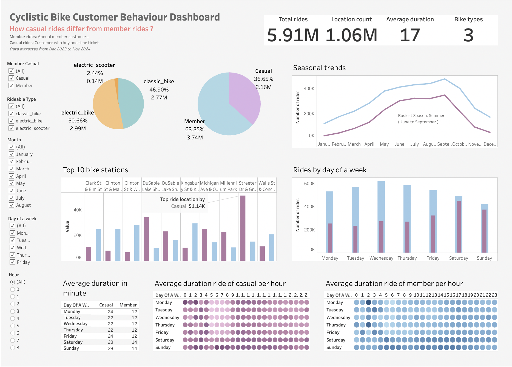
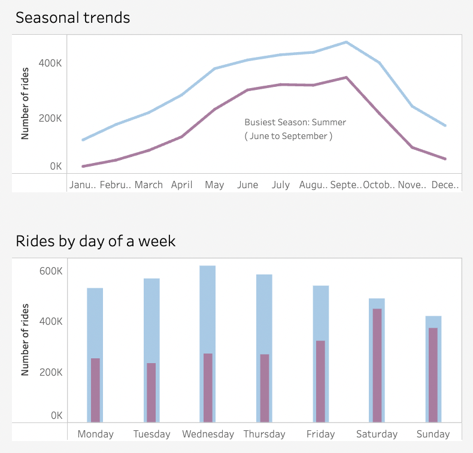
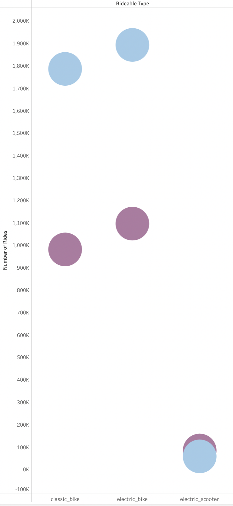
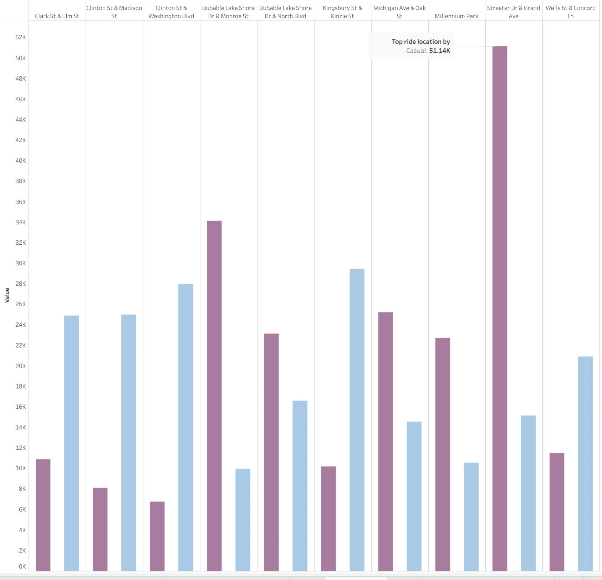
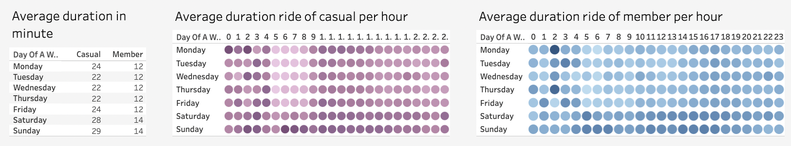

# Cyclistic Customer Behavior Analysis

# Table of Contents

<!-- TOC -->

- [Project Background](#project-background)
- [Data Structure & Initial Checks](#data-structure--initial-checks)
- [Executive Summary](#executive-summary)
- [Insights Deep Dive](#insights-deep-dive)
- [Recommendations](#recommendations)
- [Assumptions and Caveats](#assumptions-and-caveats)

<!-- /TOC -->

# Project Background
As part of the __Google Data Analytics Certificate__, this project analyzes Cyclistic’s one-year bike ride data to identify key differences in usage patterns between casual riders and annual members. The goal is to provide actionable insights that help the marketing team develop targeted strategies to convert casual riders into annual members, which is essential for Cyclistic's growth and long-term sustainability.

Cyclistic is launched in 2016, operates a widely-used bike-share program in Chicago with over 5,800 bikes and 692 stations across the city. Customers can rent bikes via single rides, full-day passes, or annual memberships. While annual members are vital to the company’s business model, casual riders represent a significant portion of overall usage.

[Read More About the Case Study Here](/Case%20Study%201_How%20does%20a%20bike-shared%20navigate%20speedy%20success_.pdf)

Insights and recommendations are provided on the following key areas:

- **Category 1**: Ride patterns by hour of the day, day of the week, and season for casual users and members
- **Category 2**: Most popular bike types for casual users and members
- **Category 3**: Most popular ride locations for casual users and members
- **Category 4**: Average ride duration (minutes) by day of the week and hour of the day for casual users and members 

Data sources can be found here [link](https://divvy-tripdata.s3.amazonaws.com/index.html).  
  
The Python script used to integrate 12-month CSV file data (from December 2023 to November 2024) can be found here [link](./Combine_Datasets.ipynb).  
  
The SQL queries used to inspect and clean the data for this analysis can be found here [link](Data_Cleaning.sql).  

The SQL queries regarding various business questions can be found here [link](Data_Analysis.sql).

An interactive Tableau dashboard used to report and explore ride trends can be found here [link](https://public.tableau.com/app/profile/aimee.le9707/viz/CyclisticDashboard_17343165311580/Dashboard1).
  
# Data Structure & Initial Checks

For scope of this project, I only created a single table in the cyclistic database for analysis. The table contains columns: `rides_id, riable_type, arted_at, ended_at, start_station_name, start_station_id, end_station_name, end_station_id, start_lat, start_lng, end_lat, end_lng, member_casual`

There are 5,906,269 records and 13 variables in the table.

__Desplay the first 10 rows of the table__

__Data cleaning and transformation code__

  
There were some null values in the start and end locations; however, these rows still contained valid latitude and longitude data. Since this does not affect my analysis, I decided to not delete these rows.
  
The table after cleaning has 5,905,278 records (991 rows were deleted)
  
# Executive Summary

### Overview of Findings

The data reveals that casual riders account for 36.65% of total rides, with electric bikes being the most popular choice, comprising 50.66% of all rides. Key trends show that summer is the peak season, and casual riders tend to use bikes on weekends, while members prefer mid-week rides, particularly Wednesdays. Additionally, casual riders have longer ride durations (approximately 25 minutes vs. 13 minutes for members) and exhibit distinct travel patterns, with notable differences in departure and destination locations, such as the dominance of casual rides at the 'Streeter Dr & Grand Ave' station.

# Insights Deep Dive

### Category 1: Ride patterns by hour of the day, day of the week, and season for casual users and members

- **Main insight 1:** Casual riders exhibit clear seasonal patterns, with a significant peak during the summer months (June to September). Winter months (December to March) show a noticeable dip in ridership, suggesting a strong correlation between weather and demand for leisure rides.

- **Main insight 2:** Member rides are most frequent during weekdays, especially Wednesdays, with the majority of rides occurring during business hours. This aligns with the assumption that members primarily use the bikes for commuting, suggesting potential opportunities to optimize service availability during these peak weekday hours.

- **Main insight 3:** Casual riders tend to use the service more on weekends, with their highest activity observed on Saturdays and Sundays. This reinforces the idea that casual riders primarily use the service for leisure activities and are less likely to need bikes during work hours.

- **Main insight 4:** Both casual and member riders have a high concentration of activity in the late afternoon to early evening, particularly between 4:00 PM and 7:00 PM. This suggests a peak in demand for both types of riders during these hours, potentially influenced by work commutes and leisure activities after the workday ends.

  

### Category 2: Most popular bike types for casual users and members

- **Main insight 1:** Electric bikes are the preferred choice for both casual and member riders, accounting for the majority of rides. This preference indicates a general trend toward convenience and ease of use, especially for longer rides or more demanding terrain.

- **Main insight 2:** Classic bikes are the second most popular bike type, exhibiting ride patterns similar to those of electric bikes.  

- **Main insight 3:** While electric bikes and classic bikes are the most popular among member riders, electric scooters are favored by casual riders, though they account for only 2.44% of total rides last year. This suggests that casual riders prefer faster, smaller, and more convenient transportation options for shorter, leisure-focused trips.

   

### Category 3: Most popular ride locations for casual users and members

- **Main insight 1:** Casual riders tend to dominate high-traffic, leisure-oriented locations, such as "Streeter Dr & Grand Ave," where the highest concentration of casual rider activity is observed. This suggests a preference for scenic or recreational routes among casual users.

- **Main insight 2:** Locations like "Michigan Ave & Oak St" show a stronger presence of member riders. These areas could be viewed as more business or commuter-focused, with members using the service primarily for work-related purposes.

- **Main insight 3:** Despite casual riders comprising 36.65% of total rides, they contribute significantly to top ride locations, such as "Streeter Dr & Grand Ave." This indicates a need to explore marketing strategies that target casual riders at these high-traffic locations, with an eye toward converting them into members.

- **Main insight 4:** The geographic analysis highlights a potential strategy for targeting specific locations where casual riders dominate, such as popular tourist spots or recreational areas, with localized promotions or membership incentives designed to boost conversions.

    

### Category 4: Average ride duration (minutes) by day of the week and hour of the day for members and casual riders

- **Main insight 1:** Casual riders have an average ride duration of 25 minutes, significantly longer than the 13 minutes for members. This difference suggests that casual riders engage with the service more leisurely, possibly for activities like sightseeing or exercise.

- **Main insight 2:** Ride durations for casual riders remain fairly constant throughout the week, indicating that their usage is not highly influenced by weekdays or weekends. This contrasts with members, who have more predictable, work-related usage patterns.

- **Main insight 3:** Both casual and member riders show a preference for late afternoon to evening hours for their rides. The highest ride durations for both groups occur between 4:00 PM and 7:00 PM, suggesting that this time frame is a prime opportunity for engagement and targeted offers.

- **Main insight 4:** The longer ride durations for casual riders highlight a potential opportunity to offer tailored promotions that encourage extended use, such as discounts on longer trips or offers for those who ride during off-peak hours to balance demand.

  

# Recommendations:

- **Enhance the Membership Experience with Exclusive Perks:** Focus on enhancing the overall membership experience in ways that are exclusive to members, which makes membership feel more rewarding and valuable.  

   - Priority Access: Provide members with priority access to bikes, particularly during peak hours, ensuring rider don’t face availability issues. This will appeal to those who value convenience and predictability.   
   - Exclusive Access to Premium Bikes/Equipment: Offer members-only access to newer or upgraded models of electric bikes or scooters. Casual riders who enjoy using electric bikes may see this as a significant perk when upgrading to a membership.  
   - Free Services: Provide casual riders, especially tourists or travelers, with exclusive access to a local guide and customized bike routes/maps when they download the Cyclistic's app. This would help them explore the city with ease and enhance their overall experience.

* **Create a Community Experience:** Build a sense of community and belonging among members to make the experience more engaging and less transactional. 
   - Member-Only Events: Host exclusive events for members, such as group rides, guided tours, or networking events that align with their interests (e.g., health-focused rides, city exploration, or eco-friendly transportation initiatives). This can foster a social element to membership and appeal to casual riders who enjoy recreational riding.
   - Member Social Spaces: Create physical or virtual spaces (like a members' app or social media group) where members can connect, share their experiences, and learn from each other. These can include tips on great biking routes, sustainability initiatives, or fitness challenges.
   - Local Partnerships: Partner with local businesses to offer members exclusive benefits like discounts at cafes, restaurants, or stores near popular bike routes. This reinforces the idea that membership brings broader lifestyle benefits beyond just bike usage.

* **Make membership a seamless part of riders’ broader lifestyle—especially for casual riders who might be using bikes for fitness or leisure:** Make membership a seamless part of riders’ broader lifestyle—especially for casual riders who might be using bikes for fitness or leisure.
   - Fitness Integration: Incorporate fitness tracking features into the app, allowing riders to track their rides, calories burned, and overall progress. For example, “Ride Challenges” can motivate casual riders to hit fitness goals, making them more likely to transition to membership.
   - Personalized Recommendations: Use data to offer personalized ride suggestions based on past behavior. If a casual rider frequently rides during certain times, suggest local fitness routes, or scenic trails to explore, turning the ride into an ongoing activity rather than just transportation.
   - Integration with Other Fitness Apps: Allow the bike-sharing service to integrate with popular fitness apps (like Strava, Apple Health, or Fitbit) to give members a more holistic view of their physical activity. Casual riders who enjoy tracking their exercise will find this an added incentive.

* **Offer Flexible Membership Plans:** Provide flexible membership options that cater to varying needs, making it easy for casual riders to transition without feeling locked into a rigid contract.
   - Flexible Payment Options: Introduce pay-as-you-go or monthly membership options, so casual riders who aren't ready for an annual commitment can still access some membership benefits on a shorter-term basis. For example, they could pay monthly for an annual membership but with the option to cancel at any time.
   - Tiered Memberships: Offer tiered membership levels that allow casual riders to choose a plan based on how often they ride. For example, a "Weekender Membership" for those who only ride on weekends or a "Commute Plus" for those who ride during weekdays but not every day.
   - Family or Group Plans: Allow riders to opt for family or group memberships, where they can bundle several users into one membership for a discounted rate. This can encourage casual users who ride with friends or family to consider a membership as a more convenient and cost-effective solution.

* **Provide Better Onboarding and Education:** Focus on educating casual riders about the benefits and convenience of a membership through seamless onboarding.
   - Interactive Onboarding: When casual riders first use the service, provide a step-by-step interactive tutorial in the app explaining the value of membership (e.g., priority access, unlimited rides, exclusive bike models). Show riders how the system works and how it can save them time and hassle, especially for frequent riders.
   - Personalized Outreach: After a few rides, use targeted push notifications or emails to inform casual riders about the benefits of becoming a member, such as enhanced convenience, exclusive content, or long-term savings.
   - Member “Ambassadors”: Empower existing members to act as ambassadors by sharing their positive experiences with casual riders. You could offer non-monetary rewards (e.g., exclusive event invites) to ambassadors who successfully encourage casual riders to join the membership.

* **Sustainability and Eco-Friendly Focus:** Appeal to eco-conscious casual riders by highlighting the environmental benefits of becoming a member and supporting green initiatives.
   - Carbon Footprint Tracking: Allow riders to track how much CO2 they've saved by using the bike-sharing service. This can resonate with casual riders who care about sustainability, showing that their decision to ride is making a positive impact.
   - Eco-Friendly Campaigns: Emphasize the eco-friendly nature of membership by promoting that annual memberships help the company maintain and expand its sustainable bike fleet, which could appeal to the environmentally conscious rider. This message can be incorporated into membership materials or shared through educational content.
 
 To effectively target casual riders, marketing efforts should focus on the peak months (June to September) and weekends, when they are most active. Highlight electric and classic bikes, which are popular among both casual and member riders. Tailored marketing campaigns should be directed at high-traffic locations like "Streeter Dr & Grand Ave," where casual riders tend to gather, with the goal of converting them into members. Additionally, marketing during the peak activity window from 4:00 PM to 7:00 PM can help attract more attentions during these high-demand hours.

# Assumptions and Caveats:

Throughout the analysis, multiple assumptions were made to manage challenges with the data. These assumptions and caveats are noted below:

* **Assumption 1:** Seasonal trends were assumed based on historical data from previous years, assuming similar patterns for 2024. We anticipate similar summer peaks and winter declines in ridership.

* **Assumption 2:** Missing station names for certain locations were excluded from the visualization but retained in the analysis, as the latitude and longitude data were still valid.

* **Assumption 3:** Data anomalies, such as missing timestamps or unclear ride end locations, were excluded from the analysis to maintain accuracy and relevance.
